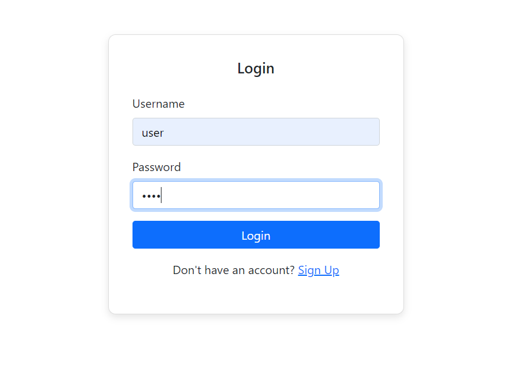
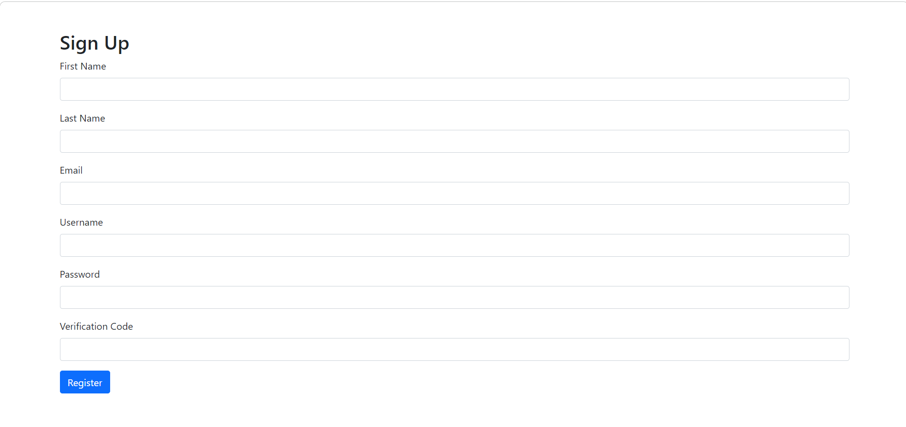
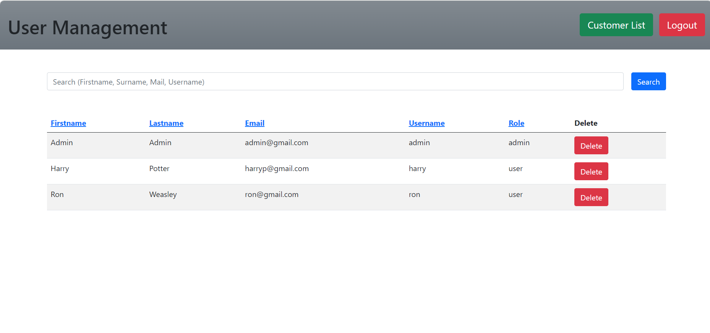

# CRM - Customer Relationship Management System

This is simple Spring application for CRM created using Spring MVC and Hibernate.

**Original project**: [Link to Original Project](https://github.com/CryptoSingh1337/crm-springmvc-hibernate)

## Illustrative image

## Features
- CRUD Operations for Customter
- CRUD Operations for User
- User Authentication
- Admin Authorization
## Technology Stack
- Java 8+
- SpringMVC
- Hibernate
- Tomcat 9
- Mysql 8
- Maven